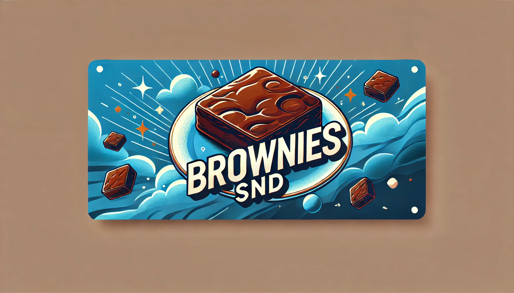

**Hop on brownies :)**

## Gambling & Bank System for Plutonium T6 (Black Ops II)

Lightweight in-game economy, gambling, and shop plugin for Plutonium T6 servers! Chat commands, persists balances to JSON, and optionally hooks GSC game events (spawn/kill, etc.) and a Discord bot for account linking.

### Features
- **Bank system**: persistent balances in `core/database/data/bank.json`
- **Gambling**: classic 50/50 gamble and a high-risk ban-flip mode
- **Payments**: send money to other players
- **Claims**: hourly/daily/weekly/monthly rewards (+ role-based claims)
- **Richest leaderboard**: top 5 balances
- **Shop**: buy server actions/roles with in-game money
- **Admin tools**: give/take/reset balances, manage owners
- **Events (optional)**: spawn/kill bonuses via GSC
- **Discord (optional)**: `/link` token flow to link Discord ↔ in-game

### Requirements
- **Python** 3.10+ (3.11+ recommended)
- Install deps: `pip install -r requirements.txt`

### Quick start
#### 1. Clone this repo and install dependencies:
     ```bash
     git clone https://github.com/Yallamaztar/Gambling-Plugin-T6.git
     pip install -r requirements.txt
     ```

#### 2. Set IW4M/IW4MAdmin environment variables (used by `core/wrapper.py`):
   - **IW4M_URL**: Base URL to your IW4M/IW4MAdmin API (e.g. `http://127.0.0.1:1624`)
   - **IW4M_ID**: Server ID managed by IW4M/IW4MAdmin
   - **IW4M_HEADER**: Cookie header value for an authenticated IW4M/IW4MAdmin session
   - PowerShell example:
     ```bash
     $env:IW4M_URL = "http://127.0.0.1:1624"
     $env:IW4M_ID = "1"
     $env:IW4M_HEADER = ".AspNetCore.Cookies=YOUR_COOKIE_HERE"
     ```

#### 3. (Optional) Install the GSC events script (for spawn/kill bonuses):
   - Copy `scripts/mp/gsc-events.gsc` into your Plutonium T6 server scripts folder, for example:
     - `Plutonium\storage\t6\scripts\mp\gsc-events.gsc` (preferred for dedicated)
   - The script enables `scr_allowFileIo` and writes `event_*.jsonl` files used by the Python event client.

#### 4. Run the plugin:
   ```bash
   python main.py
   ```

### Commands
Prefix is **!**. Abbreviations are shown after a slash. Amounts accept suffixes: `k, m, b, t, q, z` (e.g., `5k`, `2m`). Many commands are rate-limited; owners are exempt.

- **usage/u [page]**: Show usage pages
- **gamble/g <amount>**: 50/50 to win or lose the amount
- **balance/bal [player]**: Show your or another player's balance
- **pay/p <player> <amount>**: Transfer money to another player
- **richest/rich**: Show top 5 richest players
- **banflip/bf <amount> <duration>**: High-risk flip; if you lose you are temp-banned for the given duration. Duration supports `m/h/d` units with limits. Longer bans yield higher multipliers.
- **hourly/day/weekly/mnth**: Claim periodic rewards (rate-limited)
  - Hourly: $100,000
  - Daily: $1,500,000
  - Weekly: $12,500,000
  - Monthly: $100,000,000
- **dailyCertified (dc), weeklyCertified (wc)**: Role-limited claims for `Trusted` players
- **shop/shp [item] [target?]**: Buy items/roles. Item can be name or number. Prices:
  - `fastrestart` (1): $2,000,000,000 (executes fast restart)
  - `gambler` (2): $500,000,000,000 (sets level to Trusted; optional target)
  - `senioradmin` (3): $250,000,000,000,000,000 (sets level to SeniorAdmin; optional target)
  - `owner` (4): $500,000,000,000,000,000,000 (adds Gambling Owner; optional target)
- **link/lnk**: Generates a short token to link in Discord via `/link <token>`

#### Admin-only
- **give/gi <player> <amount>**
- **giveall/ga <amount>**
- **take/t <player> <amount|half|all>**
- **takeall/ta <amount|half|all>**
- **reset/res**: Reset all balances
- **addowner/add <player>**, **removeowner/rmv <player>**

### Passive income & events
- **Passive income**: Every 10 minutes, each connected player receives $250,000.
- [**GSC events (optional)**](https://github.com/Yallamaztar/gsc-events-py/) via `scripts/mp/gsc-events.gsc`:
  - On spawn: +$2,500
  - On kill: attacker +$15,000
  - On suicide: player +$25,000

### Data & configuration
- **Bank**: `core/database/data/bank.json`
- **Owners**: `core/database/data/owners.json` (bootstrap owners by adding names here or using `!addowner` in-game)
- **Discord link tokens**: `core/database/data/tokens.json`
- **Discord linked accounts**: `core/database/data/linked.json`

### Optional: Discord bot (not ready)
- File: `core/bot.py` (disabled by default)
- Slash commands: `/link`, `/unban`
- To enable:
  1. Set `BOT_TOKEN` environment variable
  2. Uncomment the `run_bot` lines in `main.py`

### [IW4M/IW4MAdmin wrapper](https://github.com/Yallamaztar/iw4m)
`core/wrapper.py` expects `IW4M_URL`, `IW4M_ID`, `IW4M_HEADER`. It exposes `server`, `player`, and `commands` used by the plugin to send messages, fast-restart, set levels, temp-ban/unban, etc.

### Notes & tips
- Some commands have cooldowns (`rate_limit`). Owners are exempt.
- Abbreviations for amounts are supported everywhere (`10k`, `2m`, `3b`, `1t`, `4q`, `1z`).
- If events do not fire, verify the GSC script path and that `scr_allowFileIo` is enabled.
- If server commands fail, verify your IW4M/IW4MAdmin cookie header and server ID.

### License
This project is licensed under the terms of the **Apache-2.0 license**. See `LICENSE`.

---

# Come Play on Brownies SND 🍰
### Why Brownies? 🤔
- **Stability:** Brownies delivers a consistent, lag-free experience, making it the perfect choice for players who demand uninterrupted action
- **Community:** The players at Brownies are known for being helpful, competitive, and fun—something Orion can only dream of
- **Events & Features:** Brownies is constantly running unique events and offers more server-side customization options than Orion, ensuring every game feels fresh

---

#### [Brownies Discord](https://discord.gg/DtktFBNf5T) | [Brownies IW4M](http://193.23.160.188:1624/) | Made With ❤️ By Budiworld